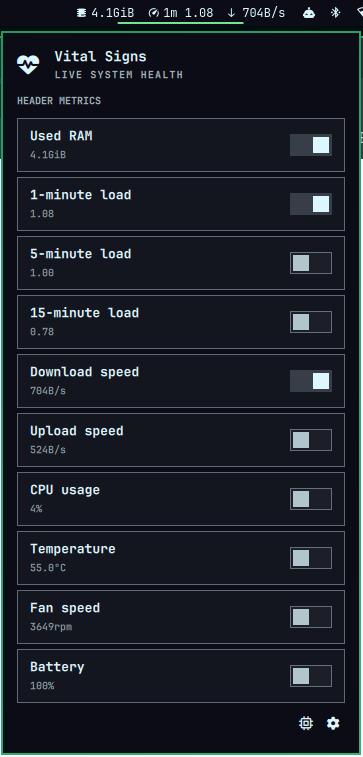

# Vital Signs

An Omarchy 4 shell plugin that displays selectable live system metrics in the
bar. Click the status line to choose metrics; use the settings page to control
the refresh rate, bar alignment, empty-value visibility, and metric icons.
The Advanced page lists top CPU and RAM processes owned by the current user,
with confirmed termination actions, plus a separately confirmed privileged
kernel OOM trigger.




## Requirements

- Omarchy 4 with `omarchy-shell`
- A Linux system exposing metrics through `/proc` and `/sys`
- Standard Omarchy command-line tools: Bash, `awk`, GNU `ps`, `getconf`, and
  `pkexec`

## Installation

Install and enable the plugin directly from GitHub:

```bash
omarchy plugin add https://github.com/harel/omarchy-vital-signs.git --enable
```

The command asks for confirmation because Omarchy plugins run inside the
long-lived shell process. After installation, **Vital Signs** appears in the
bar's right section by default.

To update an existing installation:

```bash
omarchy plugin update harel.vital-signs
```

To remove it:

```bash
omarchy plugin remove harel.vital-signs
```

## Local development

Clone the repository anywhere, then symlink it into Omarchy's user plugin
directory:

```bash
git clone https://github.com/harel/omarchy-vital-signs.git
cd omarchy-vital-signs
mkdir -p "$HOME/.config/omarchy/plugins"
ln -s "$PWD" "$HOME/.config/omarchy/plugins/harel.vital-signs"
omarchy-shell shell rescanPlugins
omarchy plugin enable harel.vital-signs
```

After changing QML or scripts behind the development symlink, restart the shell
to ensure the linked source is reloaded:

```bash
omarchy restart shell
```

Use `omarchy-shell shell rescanPlugins` when adding a new plugin or entry point.

## Process monitoring

Process collection runs only while the Advanced page is open. The settings
page offers two CPU calculation modes:

- **Live delta** (default) calculates CPU usage from kernel tick differences
  between samples. RAM appears after the first sample; CPU appears after the
  second, with a measuring message shown in the meantime.
- **ps average** uses GNU `ps` lifetime-average CPU values and appears after the
  first sample.

By default, CPU follows the familiar `top`/`ps` per-core convention: 100% means
one logical CPU is fully occupied, so a multithreaded process can exceed 100%.
Disable **Use per-core CPU percentage** to normalize each process against the
machine's total logical CPU capacity instead.

The collector excludes itself and its sampling children from the results.

## Notes

- Network speed is the combined receive rate for all non-loopback interfaces.
- Battery percentage is read from the first battery exposed in Linux sysfs.
- Temperature and fan availability depend on what the kernel exposes through
  `/sys/class/hwmon`; unsupported hardware is shown as “Not reported”.
- All metrics are read locally without root privileges.
- The process list is restricted to the current user's processes. Termination
  sends `SIGTERM` without privilege escalation after an in-panel confirmation
  and revalidates the PID, process name, ownership, and kernel start time to
  protect against PID reuse.
- The kernel OOM trigger is an intentionally destructive emergency control. It
  requires a separate in-panel confirmation followed by `pkexec` authorization,
  then writes `f` to `/proc/sysrq-trigger`. The kernel chooses a memory-consuming
  process to kill; this can cause data loss or destabilize the session.
